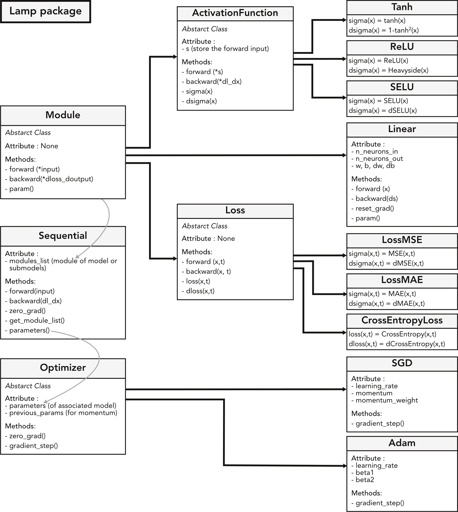
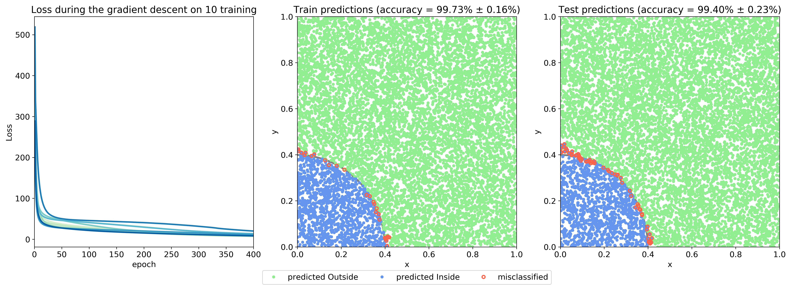

# Deep Learning Framework : Lamp
Lamp is a deep learning framework built using pytorch.Tensor object but without making use of the autograd machinery.

# Lamp Structure

This framework enables to train a multilayer perceptron. It implements linear layers, different activation functions (ReLU, SELU, TanH), different losses (MSE, MAE, CrossEntropy), and different optimizers (standard gradient descent, gradient descent with momentum, and Adam).

Lamp support the training of a MLP by batches.

# Toy example
To test the lamp framework a toy example is made. The goal is to predict wether a point in 2D from [0,1;0,1] lays inside a circle of diameter 1/sqrt(2pi) centered on the origin.

